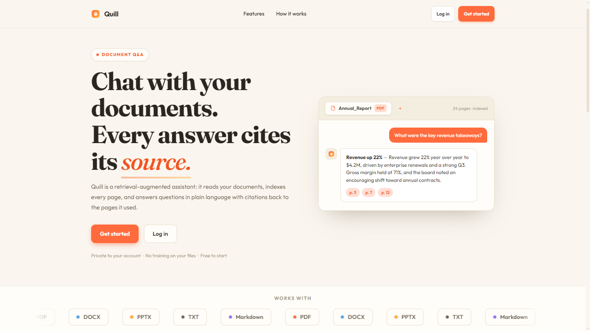
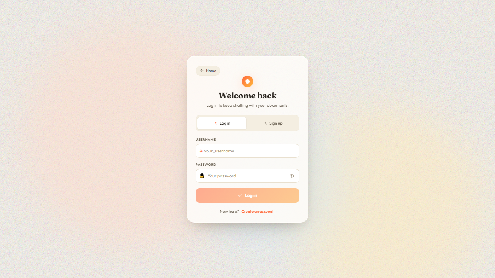
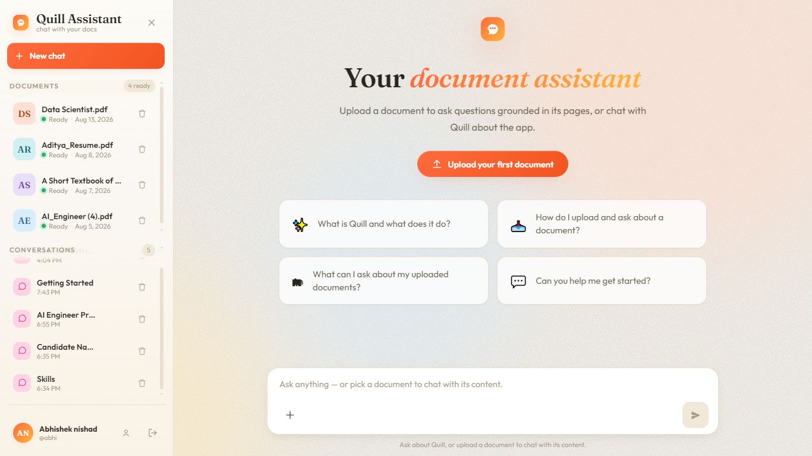

# Quill

## Project Description

Quill is an AI-powered Enterprise Knowledge Assistant that transforms your documents into an intelligent, searchable knowledge base. Upload PDFs and chat with them naturally — Quill understands context, remembers conversations, and provides accurate answers with source citations.

## Features

- **Document Intelligence** — Upload PDFs, auto-chunk and embed them into a vector store for semantic search
- **AI-Powered Q&A** — Ask questions in natural language and get context-aware answers grounded in your documents
- **Streaming Responses** — Real-time token-by-token answer streaming via Server-Sent Events
- **Conversation Memory** — Multi-turn conversations with persistent history powered by LangGraph checkpoints
- **Source Citations** — Each answer includes page-level references from the original document
- **Auto-Generated Titles** — Conversations are automatically named based on the first question
- **Dual Mode** — Document-specific RAG answers or general "concierge" chat when no document is selected
- **Secure Authentication** — JWT-based user registration and login system
- **Responsive Design** — Fully responsive UI that works on desktop and mobile
- **Dockerized Deployment** — One-command setup with Docker Compose

## Tech Stack

| Layer | Technology |
|-------|-----------|
| Frontend | React 19, TypeScript, Vite 8, Motion (Framer Motion) |
| Backend | Python 3.13, FastAPI, SQLAlchemy, Alembic |
| Database | PostgreSQL (metadata + conversation history) |
| AI / RAG | LangChain, LangGraph, Gemini 2.5 Flash (LLM), Mistral (embeddings) |
| Vector Store | Qdrant Cloud (semantic document search) |
| Authentication | JWT (PyJWT + Argon2 password hashing) |
| Infrastructure | Docker, Docker Compose |
| Document Processing | PyPDF, LangChain Text Splitters |

## Project Architecture

```
┌─────────────────────────────────────────────────────────┐
│                      FRONTEND                           │
│   React 19 + TypeScript + Vite + Motion (Framer)        │
│                                                         │
│   Landing → Auth → Sidebar + ChatArea + UploadModal     │
│              │            │                              │
│              ▼            ▼                              │
│         JWT Token   SSE Stream (/chat/query)            │
└──────────────┬──────────────┬───────────────────────────┘
               │ REST API     │ Server-Sent Events
               ▼              ▼
┌─────────────────────────────────────────────────────────┐
│                    BACKEND (FastAPI)                     │
│                                                         │
│  ┌──────────┐  ┌──────────┐  ┌───────────────────────┐ │
│  │  Auth     │  │ Document │  │   LangGraph Pipeline  │ │
│  │  Module   │  │ Module   │  │                       │ │
│  └──────────┘  └──────────┘  │  retrieve_documents   │ │
│       │              │        │        ↓              │ │
│       ▼              ▼        │  build_context        │ │
│  ┌──────────┐  ┌──────────┐  │        ↓              │ │
│  │ User     │  │ Upload   │  │  generate_answer      │ │
│  │ (Postgres)│  │ (PyPDF → │  │        ↓              │ │
│  └──────────┘  │  chunks) │  │  checkpoint memory    │ │
│                └──────────┘  └───────────────────────┘ │
│                                      │                  │
│                    ┌─────────────────┼──────────┐      │
│                    ▼                 ▼          ▼      │
│              ┌──────────┐    ┌──────────┐ ┌────────┐  │
│              │ PostgreSQL│    │  Qdrant  │ │ Gemini │  │
│              │ (metadata │    │ (vectors)│ │ 2.5    │  │
│              │  + memory)│    │          │ │ Flash  │  │
│              └──────────┘    └──────────┘ └────────┘  │
└─────────────────────────────────────────────────────────┘
```

**Request Flow:**
1. User uploads a PDF → PyPDF extracts text → LangChain splits into chunks → Mistral embeddings → stored in Qdrant
2. User asks a question → Qdrant retrieves relevant chunks → LangGraph builds context → Gemini generates an answer
3. Response streams token-by-token via SSE → PostgresSaver checkpoints conversation for memory
4. On the next turn, LangGraph loads prior history from checkpoint, giving the model conversational context

## Project Structure

```
rag-project/
├── backend/
│   ├── app.py                          # FastAPI application entry point + lifespan
│   ├── requirements.txt
│   ├── Dockerfile
│   ├── .env.example
│   ├── migrations/                     # Alembic database migrations
│   │   └── versions/
│   └── src/
│       ├── rag/                        # Core RAG pipeline
│       │   ├── llm.py                  # Gemini LLM instance + title generation
│       │   ├── embeddings.py           # Mistral embedding model
│       │   ├── vector_store.py         # Qdrant vector store init
│       │   ├── retriever.py            # Semantic retriever (filtered by document)
│       │   ├── loader.py              # PDF loader + text splitter
│       │   └── prompt.py              # System/human prompts (RAG + concierge)
│       ├── graph/                      # LangGraph orchestration
│       │   ├── graph.py               # Compiled StateGraph (retrieve → context → generate)
│       │   ├── nodes.py               # Graph node functions
│       │   ├── state.py               # RAGState TypedDict
│       │   ├── streaming.py           # SSE streaming orchestrator
│       │   └── checkpointer.py        # PostgresSaver singleton
│       ├── user/                       # User auth module
│       │   ├── model.py               # SQLAlchemy User model
│       │   ├── schema.py              # Pydantic request/response schemas
│       │   ├── controller.py          # Register/login logic
│       │   └── router.py             # FastAPI routes (/auth/*)
│       ├── document/                   # Document management
│       │   ├── model.py               # SQLAlchemy Document model
│       │   ├── schema.py
│       │   └── router.py             # CRUD routes (/documents/*)
│       ├── upload/                     # PDF upload + ingestion
│       │   ├── controller.py          # Extract → chunk → embed → store
│       │   ├── schema.py
│       │   └── router.py             # Upload route
│       ├── conversation/               # Conversation history
│       │   ├── model.py               # SQLAlchemy Conversation model
│       │   ├── schema.py
│       │   └── router.py             # CRUD routes (/conversations/*)
│       ├── query/                      # Chat query endpoint
│       │   ├── schema.py              # QueryRequestSchema
│       │   └── router.py             # SSE /chat/query endpoint
│       ├── admin/                      # Admin module
│       ├── qdrant/                     # Qdrant setup
│       │   ├── client.py              # Async Qdrant client
│       │   └── collection.py          # Collection creation/validation
│       └── utils/
│           ├── settings.py            # Pydantic Settings (env config)
│           ├── db.py                  # SQLAlchemy engine + session
│           └── helpers.py
├── frontend/
│   ├── package.json
│   ├── Dockerfile
│   ├── index.html
│   └── src/
│       ├── App.tsx                     # Root app with auth routing
│       ├── main.tsx                    # Entry point
│       ├── index.css / App.css
│       ├── components/
│       │   ├── Landing.tsx            # Marketing landing page
│       │   ├── AuthScreen.tsx         # Login / Register form
│       │   ├── Sidebar.tsx            # Conversation list + new chat
│       │   ├── ChatArea.tsx           # Main chat view + SSE handling
│       │   ├── ChatMessage.tsx        # Message bubble (markdown render)
│       │   ├── Composer.tsx           # Input field + send button
│       │   ├── DocumentPicker.tsx     # PDF selector sidebar
│       │   ├── UploadModal.tsx        # File upload dialog
│       │   └── Icons.tsx             # SVG icon components
│       └── lib/
│           ├── api.ts                # API client + SSE helpers
│           ├── auth.tsx              # Auth context + token management
│           ├── types.ts              # TypeScript interfaces
│           ├── palette.ts            # Theme color palette
│           └── markdown.tsx          # Markdown-to-JSX renderer
└── docker-compose.yml                 # Backend + Frontend services
```

## Demo / Live Link

https://enterpriseassistant.vercel.app/

## Screenshots

### Landing Page
<p align="center">
  
</p>

The first impression of Quill — a clean, modern landing page that introduces the product, highlights key features like document intelligence and AI-powered Q&A, and guides users to get started.

### Login
<p align="center">
  
</p>

A minimal and secure JWT-based authentication screen. Users can register or log in to access their personal document workspace, keeping conversations and files private.

### Chat Interface
<p align="center">
  
</p>

The heart of Quill — an intuitive chat UI where users upload PDFs and ask questions in natural language. Responses stream in real-time with inline page citations, and conversations are automatically named and saved for future reference.
